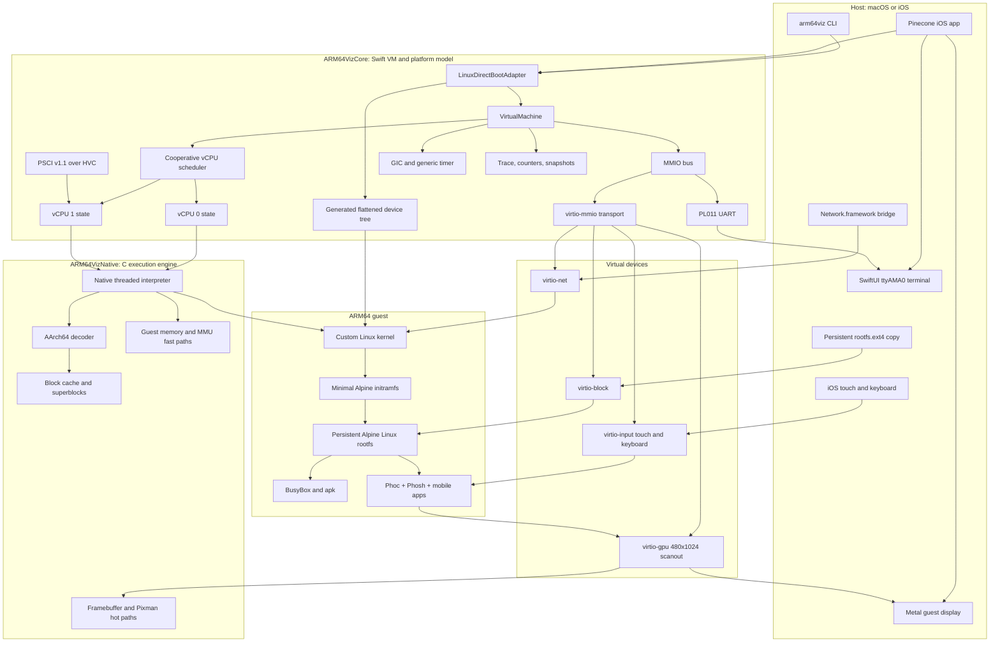

# arm64viz

`arm64viz` is a no-JIT ARM64 virtualization and emulation research platform
written in C and Swift. Its primary guest is currently a custom ARM64 Linux
configuration with an Alpine Linux root filesystem and the Phosh mobile shell.
The Pinecone iOS application hosts that VM, presents its serial console and
display, and forwards keyboard, touch, storage, and network activity.

The runtime is implemented in this repository. QEMU is not required or used by
the build, test, or execution path.

## Current Status

The project can currently:

- Direct-boot a custom ARM64 Linux kernel at EL1 with a generated FDT.
- Mount a persistent Alpine Linux ext4 root filesystem through virtio-mmio.
- Reach a BusyBox/Alpine shell on the emulated PL011 `ttyAMA0` console.
- Start Phoc and Phosh using Pixman software rendering at a guest resolution of
  480x1024.
- Present the guest framebuffer through Metal in the Pinecone iOS app.
- Deliver iOS touch and keyboard events through virtio-input.
- Expose virtio block, network, input, keyboard, and GPU devices.
- Run Alpine commands and `apk`; networking works through the host-side network
  bridge but is still slower and less complete than a mature slirp stack.
- Execute the tested Linux and Phosh workload without using the legacy Swift
  interpreter as a normal execution fallback.

Phosh is functional, but first-frame time, complex compositing, and interactive
frame rate remain active performance work. This is a research platform, not a
production mobile-device VM.

## Architecture



### Execution Boundary

- **ARM64VizNative** is the hot execution layer. It contains the AArch64
  decoder and threaded interpreter, C-side block caches and superblocks, guest
  memory primitives, MMU-related fast paths, and framebuffer operations.
- **ARM64VizCore** owns architectural CPU state, exception routing, device
  models, Linux loading, FDT generation, tracing, policy, and snapshots.
- **Pinecone** is the iOS host. Swift manages application lifecycle and bridges
  native iOS services; Linux and Phosh execute inside the ARM64 guest.
- **The guest** is open-source ARM64 Linux and Alpine userspace. Phosh renders
  through Phoc, wlroots, Pixman, DRM, and the virtual GPU.

The backend is an interpreter, not a JIT. The native engine caches decoded
blocks, links hot control-flow paths, executes fused superblocks, uses direct
guest-memory access where valid, and includes carefully validated semantic fast
paths for common guest loops. The older Swift instruction path is retained for
diagnostics, but unsupported native instructions are treated as implementation
gaps rather than silently relying on it during normal Linux execution.

## Virtual Machine Layout

The generic research-machine API defaults to one vCPU for compatibility. The
Pinecone runtime configures two Linux-visible vCPUs with separate architectural,
system-register, MMU-cache, timer, and interrupt-interface state. Linux starts
vCPU 1 through PSCI v1.1 over `HVC`; the current host scheduler runs vCPUs
cooperatively rather than on parallel host threads. RAM begins at `0x40000000`.
Its Linux-visible devices include:

| Device | Guest address | Purpose |
| --- | ---: | --- |
| GICv2 | `0x08000000` | Banked CPU interfaces, SGIs/PPIs, and targeted SPIs |
| PL011 UART | `0x09000000` | Linux boot and interactive console |
| virtio-block | `0x0a000000` | Persistent Alpine root filesystem |
| virtio-net | `0x0a001000` | Host-bridged guest networking |
| virtio-input | `0x0a002000` | Absolute touchscreen events |
| virtio-gpu | `0x0a003000` | 480x1024 DRM scanout |
| virtio-input | `0x0a004000` | Keyboard events |

The Linux boot adapter places the raw kernel `Image`, initramfs, and generated
FDT in RAM, sets `x0` to the FDT address, enters masked EL1h, and attaches the
ext4 image as `/dev/vda`.

## Repository Structure

```text
.
├── Apps/iOS/MobileOSHost       Pinecone SwiftUI/Metal iOS host
├── Sources/ARM64VizNative      C decoder, interpreter, caches, memory, pixels
├── Sources/ARM64VizCore        VM, Linux boot, MMIO, virtio, FDT, debugging
├── Sources/arm64viz            Desktop command-line tools
├── Scripts                     Kernel, initramfs, Alpine and Phosh image builds
├── Tests/ARM64VizCoreTests     CPU, MMU, device and regression tests
├── artifacts                   Generated/downloaded guest build products
├── docs                        Architecture, roadmap and scope documents
├── arm64viz.preferences.json   User restrictions layered over fixed policy
└── Package.swift               Swift Package Manager definition
```

## Requirements

The current guest-image scripts target Apple Silicon macOS. They require:

- Xcode and its command-line tools
- Swift 5.9 or newer
- XcodeGen when regenerating the iOS project
- LLVM/Clang, LLD, and GNU Make
- `libelf`, `curl`, `perl`, `awk`, and `bsdtar`
- `mke2fs` from e2fsprogs or Android platform tools
- `glib-compile-schemas` and `update-mime-database` for the Phosh image
- Network access to kernel.org and Alpine Linux package repositories

The kernel script currently defaults Homebrew tools to `/opt/homebrew`, though
the relevant paths can be overridden with its environment variables.

## Prepare the Alpine + Phosh Guest

Guest binaries are generated locally and are not normal source files. From the
repository root:

```sh
# Fetch an Alpine ARM64 virt kernel/initramfs used as build input.
Scripts/fetch-alpine-aarch64.sh

# Build the project-specific ARM64 Linux kernel and minimal initramfs.
Scripts/build-arm64-shell-kernel.sh

# Build the persistent Alpine edge rootfs. The graphical profile defaults to Phosh.
# The guest now requires the tested Pinecone GLib MIME-search package.
bash scripts/build-pinecone-glib.sh
Scripts/build-arm64-rootfs-image.sh
```

The final files consumed by Pinecone are:

```text
artifacts/linux-shell/out/Image
artifacts/linux-shell/out/initramfs-minimal-ttyinit.cpio
artifacts/linux-shell/out/rootfs.ext4
```

The rootfs builder resolves and stages Alpine edge packages for Phoc, Phosh,
Portfolio, GNOME Calculator, Calendar, Clocks, Text Editor, Foot, and their
runtime dependencies. Downloaded APKs are cached under
`artifacts/alpine-packages/edge-aarch64/`.

To build a smaller non-graphical rootfs:

```sh
ARM64VIZ_GRAPHICAL_ROOTFS=0 Scripts/build-arm64-rootfs-image.sh
```

Other supported staging profiles are `cage` and `phoc`:

```sh
ARM64VIZ_GRAPHICAL_PROFILE=phoc Scripts/build-arm64-rootfs-image.sh
```

## Artifact Policy

Do not commit `artifacts/` as a whole. It contains downloaded packages, an
extracted Linux tree, compiler output, experimental initramfs variants, and a
large writable ext4 disk image. At present, the Xcode project references the
three final files listed above directly, so they must exist before Pinecone is
built.

For shared builds or CI, publish those final guest images as versioned build
assets with checksums, or regenerate them from `Scripts/`. Do not place the
entire artifact workspace in ordinary Git history.

## Build and Run Pinecone

The checked-in Xcode project uses the application identifier
`me.gmoran.pinecone` and requires iOS 17 or newer.

Regenerate the project only after changing `project.yml`:

```sh
cd Apps/iOS/MobileOSHost
xcodegen generate --spec project.yml
```

Validate an unsigned device build:

```sh
xcodebuild \
  -project MobileOSHost.xcodeproj \
  -scheme MobileOSHost \
  -destination 'generic/platform=iOS' \
  CODE_SIGNING_ALLOWED=NO \
  -derivedDataPath .DerivedData \
  build
```

For a physical iPhone, open `MobileOSHost.xcodeproj`, select a development
team, choose the connected device, and run. Pinecone remains a normal sandboxed
iOS application; it does not modify the phone boot chain or replace iOS.

Pinecone copies the bundled root filesystem into Application Support and uses
that copy as file-backed virtio storage. Guest writes therefore survive VM
restarts. The app provides:

- A scrollable `ttyAMA0` console with keyboard and paste support
- VM reset, power, and stop controls
- A full-screen-scaled guest display surface
- Touch forwarding with guest-coordinate conversion
- Incremental framebuffer presentation through Metal
- Runtime counters for native execution, devices, display, and input latency

Inside the guest, start the graphical session with:

```sh
start-pinecone-phosh
```

## Desktop Tools

Build and test the core:

```sh
swift build -c release
swift test
```

Run the small UART architecture smoke test:

```sh
swift run -c release arm64viz run-toy
```

Prepare and inspect the generated Linux handoff without executing it:

```sh
swift run -c release arm64viz prepare-linux \
  artifacts/linux-shell/out/Image \
  --initrd artifacts/linux-shell/out/initramfs-minimal-ttyinit.cpio \
  --disk artifacts/linux-shell/out/rootfs.ext4 \
  --memory-mib 512 \
  --bootargs "console=ttyAMA0 earlycon=pl011,mmio32,0x9000000 root=/dev/vda rw rootwait rdinit=/init loglevel=7"
```

Run a bounded Linux trace through the native backend:

```sh
swift run -c release arm64viz run-linux-trace \
  artifacts/linux-shell/out/Image \
  --initrd artifacts/linux-shell/out/initramfs-minimal-ttyinit.cpio \
  --disk artifacts/linux-shell/out/rootfs.ext4 \
  --memory-mib 512 \
  --symbols artifacts/linux-shell/out/System.map \
  --trace-depth 256 \
  --max-steps 100000000 \
  --bootargs "console=ttyAMA0 earlycon=pl011,mmio32,0x9000000 root=/dev/vda rw rootwait rdinit=/init loglevel=7"
```

Additional tools include instruction coverage auditing, differential SIMD
tests, DTS/FDT inspection, VM snapshots, boot-adapter planning, and policy
validation. Run `swift run arm64viz --help` for the current command list.

## Networking

The guest uses a private IPv4 network:

```text
guest:   10.0.2.15
gateway: 10.0.2.2
DNS:     10.0.2.3
```

The virtio-net backend bridges guest traffic to host networking using Apple
Network.framework. TCP and UDP flows used by Alpine package operations are the
primary supported path. This implementation is independent of QEMU slirp and
is still under optimization; `apk update` can be noticeably slower than on a
native Linux machine, and ICMP behavior should not be treated as a complete
measure of Internet connectivity.

Early boot configures this address without waiting for desktop services.
When Phosh starts, NetworkManager adopts the matching `Pinecone Internet`
profile and becomes the network configuration owner. It exposes virtual
Ethernet in Settings; it does not control the host's Wi-Fi or cellular radios.
`pinecone-network status` reports the guest connection. A connected interface
is not itself proof of Internet reachability.

Public hostnames resolve through the host resolver. The optional package
proxy remains explicitly available at `http://10.0.2.2/alpine/`; public Alpine
hostnames are not redirected to that HTTP-only endpoint.

### Web Browser

The Phosh image includes NetSurf GTK3, accessible from the app grid and
favorites. Its default page is `https://example.com/`. From a terminal inside
the Phosh session, run `pinecone-launch-browser https://example.com/`.
The browser uses the guest CA bundle and retains its profile on the persistent
root filesystem. No on-device package installation is needed.

This is a basic HTML/CSS browser, not a Chromium/WebKit replacement. JavaScript
is disabled in the initial profile and many modern web apps will not work.
NetSurf has no renderer sandbox, and the current demo desktop runs as root:
use trusted test pages only, without sensitive credentials. Browser isolation
and modern web-app compatibility remain separate work; TLS validation is not
disabled to obtain connectivity.

## Debugging and Performance

The native backend exposes counters for decoded blocks, cache hits, linked
blocks, superblocks, page translations, direct memory access, semantic fast
paths, and unsupported instructions. Pinecone keeps guest UART output separate
from host diagnostics.

The simulator supports opt-in diagnostic environment variables, including:

| Variable | Effect |
| --- | --- |
| `PINECONE_SIMULATOR_AUTORUN_COMMAND` | Runs a guest command after shell startup |
| `PINECONE_SIMULATOR_DUMP_UART=1` | Writes captured UART diagnostics |
| `PINECONE_SIMULATOR_DUMP_PERFORMANCE=1` | Writes runtime performance data |
| `PINECONE_SIMULATOR_DUMP_FRAMEBUFFER=1` | Dumps framebuffer diagnostics |
| `PINECONE_SIMULATOR_HOT_PC_PROFILE=1` | Enables sampled native hot-PC profiling |
| `PINECONE_GUEST_MEMORY_MB` | Overrides configured guest RAM |

Hot-PC profiling is disabled by default so diagnostics do not affect normal VM
performance.

## Known Limitations

- The VM currently exposes one virtual CPU.
- Execution is interpreted and does not use JIT compilation, HVF, or KVM.
- AArch64 coverage is driven by Linux/Alpine/Phosh and is not yet a formal
  implementation of every optional architectural extension.
- Phosh software rendering is functional but still CPU-intensive and can be
  choppy during complex redraws.
- The host network bridge is less complete and slower than mature QEMU/UTM
  networking.
- Audio, cameras, sensors, telephony, suspend/resume, and hardware 3D
  acceleration are not implemented as guest devices.
- The root filesystem is an Alpine edge image assembled by project scripts,
  not an official postmarketOS or distribution image.

## Scope and Guardrails

This repository implements generic virtualization infrastructure and
open-source guest support. It does not provide or request proprietary mobile OS
images, firmware blobs, boot ROM code, device keys, certificates, secure
processor secrets, activation material, attestation bypasses, or proprietary
service impersonation.

Guest adapters are pluggable, but the implemented boot path is for open Linux
guests. The proprietary-guest adapter is a metadata boundary validator only; it
does not ingest, extract, decrypt, or boot proprietary OS packages. Built-in
prohibitions cannot be disabled by `arm64viz.preferences.json`; preferences can
only add restrictions.

See:

- [Architecture notes](docs/architecture.md)
- [Roadmap](docs/roadmap.md)
- [Proprietary guest boundaries](docs/proprietary-guest-boundaries.md)

## QEMU, HVF, and KVM

- **Current software backend:** portable, deterministic, inspectable, and able
  to run inside an ordinary iOS app, at the cost of interpreter overhead.
- **QEMU:** useful as an external behavioral reference, but not a dependency or
  runtime component of arm64viz.
- **HVF:** a possible macOS-only acceleration backend; it does not provide a
  general App Store-compatible iOS execution path.
- **KVM:** appropriate for a future Linux-hosted accelerated backend, requiring
  Linux and hardware virtualization support.

The immediate engineering focus is native AArch64 completeness, lower guest
CPU cost, faster Pixman compositing, reduced Phosh first-frame time, and a more
complete host network bridge.
