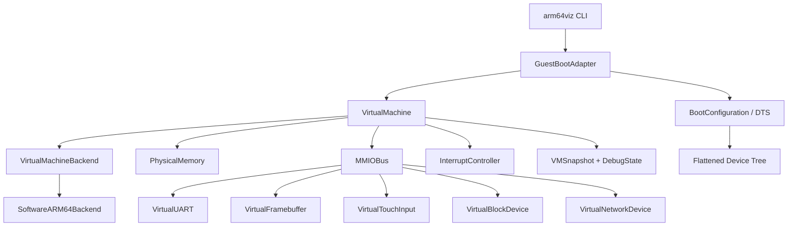

# arm64viz

`arm64viz` is a dependency-free ARM64 virtualization research framework. The
current proof of concept uses a small software AArch64 backend and a toy guest
that writes to a virtual UART through MMIO. It does not require QEMU, firmware
images, device keys, activation material, or service impersonation.

The design keeps guest boot policy pluggable, but this repository only
implements open-source or toy guest paths.

## Architecture



The runtime boundary is intentionally simple:

- `VirtualMachineBackend` owns execution strategy.
- `VirtualMachine` owns CPU state, RAM, MMIO routing, breakpoints, and snapshots.
- `MMIODevice` implementations are address-ranged peripherals.
- `GuestBootAdapter` loads a guest and produces a boot configuration.
- `BootConfiguration` can render a DTS-style description for open guests.
- `FlattenedDeviceTree` emits binary FDT blobs for native Linux handoff.

## Repo Structure

```text
.
├── Apps
│   └── iOS
│       └── MobileOSHost
│           ├── MobileOSHost.xcodeproj
│           ├── README.md
│           ├── Sources
│           └── project.yml
├── Package.swift
├── README.md
├── arm64viz.preferences.json
├── docs
│   ├── architecture.md
│   ├── proprietary-guest-boundaries.md
│   └── roadmap.md
├── ui
│   ├── app.js
│   ├── boot-lab.html
│   ├── mobile-os.css
│   ├── mobile-os.html
│   ├── mobile-os.js
│   └── styles.css
├── Sources
│   ├── ARM64VizCore
│   │   ├── BootPlanning.swift
│   │   ├── BootAdapters.swift
│   │   ├── BootConfiguration.swift
│   │   ├── CPUState.swift
│   │   ├── Devices.swift
│   │   ├── EmulatorBackend.swift
│   │   ├── FlattenedDeviceTree.swift
│   │   ├── LinuxBoot.swift
│   │   ├── MachineFactory.swift
│   │   ├── Memory.swift
│   │   ├── MMIO.swift
│   │   ├── MobileOSKernel.swift
│   │   ├── ProprietaryGuestBoundary.swift
│   │   ├── RuntimeDirection.swift
│   │   ├── Snapshot.swift
│   │   ├── Types.swift
│   │   └── VirtualMachine.swift
│   └── arm64viz
│       └── main.swift
└── Tests
    └── ARM64VizCoreTests
        └── ARM64VizCoreTests.swift
```

## Minimal Proof Of Concept

Run the toy guest:

```sh
swift run arm64viz run-toy
```

Expected output includes the guest string emitted through virtual UART and a
stop reason:

```text
arm64viz toy guest

[arm64viz] backend=software-aarch64-subset
[arm64viz] stop=halted steps=41
```

Prepare a native ARM64 Linux/postmarketOS handoff without QEMU:

```sh
swift run arm64viz prepare-linux Image --postmarketos --initrd initrd.cpio.gz --disk rootfs.img --memory-mib 1024
```

This command loads the kernel into guest RAM, stages initrd and disk bytes,
generates or loads a binary FDT, sets `x0` to the FDT address, and prints the
handoff state. The direct Linux handoff enters the guest in masked EL1h. The
current software backend can execute a small set of early ARM64 branch,
PC-relative addressing, stack-pointer arithmetic, pair load/store, and barrier
instructions. It also has a deterministic EL1 system-register bank and an
initial 4 KB stage-1 page-table walker for translated instruction/data access.
It now handles first-level synchronous exception routing for `SVC`,
instruction/data aborts, and `ERET`. It still cannot execute a full Linux
kernel, but the platform now has a minimal GIC-style interrupt controller,
EL1 IRQ vectoring, ARM generic timer IRQ assertion, PL011-style UART interrupt
registers, discoverable virtio-mmio block/net/input/display devices, and basic
MMU access-flag/read-only/execute-never faults. Linux-grade interrupt
priority/EOI behavior, broader MMU attributes, PL011 FIFO/control fidelity, and
virtio descriptor-ring execution are the next native execution work.

To inspect the first native execution failure without QEMU:

```sh
swift run arm64viz run-linux-trace Image --postmarketos --memory-mib 1024 --max-steps 64 --trace-depth 16
```

`run-linux-trace` uses the same `LinuxDirectBootAdapter`, runs the owned
software backend for a bounded number of steps, and emits JSON with the current
CPU state, recent fetched instructions, recent routed exceptions, the
instruction or exception loop if one is hit, and the next backend components to
implement.

Build the internal ARM64 shell kernel and tty initramfs:

```sh
scripts/build-arm64-shell-kernel.sh
```

The script emits the custom Linux `Image`, the generated FDT-compatible shell
initramfs, and the reproducible `/init` overlay under `artifacts/linux-shell/out/`.
The shell kernel profile includes PL011 console, virtio-mmio block, and ext4 so
it can hand off from initramfs to a small writable root disk.

Build the first persistent root filesystem image:

```sh
scripts/build-arm64-rootfs-image.sh artifacts/linux-shell/out/rootfs.ext4
```

The image is an ext4 filesystem populated from the shell initramfs plus
`/sbin/init`. The initramfs tries to mount `/dev/vda` and `switch_root` into it;
if no virtio disk is published, it falls back to the initramfs shell.

Run the Linux shell handoff:

```sh
swift run arm64viz prepare-linux artifacts/linux-shell/out/Image \
  --initrd artifacts/linux-shell/out/initramfs-virt-ttyinit.cpio \
  --disk artifacts/linux-shell/out/rootfs.ext4 \
  --memory-mib 512 \
  --bootargs "console=ttyAMA0 earlycon=pl011,mmio32,0x9000000 root=/dev/vda rw rootwait rdinit=/init loglevel=7"
```

Trace the shell canary and inject a command after `/init` opens the console:

```sh
swift run -c release arm64viz run-linux-trace artifacts/linux-shell/out/Image \
  --initrd artifacts/linux-shell/out/initramfs-virt-ttyinit.cpio \
  --disk artifacts/linux-shell/out/rootfs.ext4 \
  --memory-mib 512 \
  --max-steps 400000000 \
  --trace-depth 256 \
  --bootargs "console=ttyAMA0 earlycon=pl011,mmio32,0x9000000 root=/dev/vda rw rootwait rdinit=/init loglevel=7" \
  --uart-input-after-output "arm64viz init: ttyAMA0 console ready" \
  --uart-input-line "echo TTYINIT_OK"
```

For a quick bounded runtime smoke, stop at the first UART byte:

```sh
swift run -c release arm64viz run-linux-trace artifacts/linux-shell/out/Image \
  --initrd artifacts/linux-shell/out/initramfs-virt-ttyinit.cpio \
  --disk artifacts/linux-shell/out/rootfs.ext4 \
  --memory-mib 512 \
  --max-steps 100000000 \
  --stop-on-uart
```

Build the internal iOS hardware test host:

```sh
cd Apps/iOS/MobileOSHost
xcodegen generate --spec project.yml
xcodebuild -project MobileOSHost.xcodeproj -scheme MobileOSHost -destination generic/platform=iOS CODE_SIGNING_ALLOWED=NO -derivedDataPath .DerivedData build
```

Dump the generated boot configuration:

```sh
swift run arm64viz dump-dts
```

Export a JSON snapshot summary after running the toy guest:

```sh
swift run arm64viz snapshot
```

Validate a metadata-only proprietary guest manifest without ingesting or
booting proprietary OS packages:

```sh
swift run arm64viz validate-manifest examples/research-guest-manifest.json --preferences arm64viz.preferences.json
```

Print the effective policy preferences:

```sh
swift run arm64viz policy-show --preferences arm64viz.preferences.json
```

List adapter descriptors:

```sh
swift run arm64viz adapters
```

Plan local boot artifacts without reading their contents:

```sh
swift run arm64viz plan-boot Image initrd.cpio.gz --preferences arm64viz.preferences.json
```

Open the drag-and-drop Boot Lab UI:

```text
ui/boot-lab.html
```

Open the archived JavaScript MobileOS page:

```text
ui/mobile-os.html
```

Run tests:

```sh
swift test
```

## First Milestone Without QEMU

The first milestone is the checked-in software framework:

1. Load a toy ARM64 guest through `ToyUARTGuestAdapter`.
2. Prepare an ARM64 Linux/postmarketOS handoff through `LinuxDirectBootAdapter`.
3. Execute a small AArch64 instruction subset in `SoftwareARM64Backend`.
4. Route physical memory and MMIO accesses through `VirtualMachine`.
5. Emit UART bytes through `VirtualUART`.
6. Generate DTS/FDT boot metadata through `BootConfiguration` and
   `FlattenedDeviceTree`.
7. Save CPU/RAM/device-observable state through `VMSnapshot`.
8. Classify boot artifacts and produce adapter plans without reading restricted
   package contents.

## Native Linux Direction

The active project direction is native ARM64 Linux/postmarketOS bring-up:

- A native Linux/postmarketOS preparation path through
  `swift run arm64viz prepare-linux`.
- Binary FDT generation for Linux direct boot.
- Initrd and disk-image staging.
- A planner entry named `linux-direct`, marked loadable until CPU execution
  support catches up.
- An internal iOS hardware test host at `Apps/iOS/MobileOSHost` that prepares
  a Linux handoff and reports the remaining backend work.

The JavaScript MobileOS track is disabled. Its Swift and JavaScript files remain
as archived reference code, but `run-mobile`, `build-mobile-image`,
`mobile-kernel-demo`, `MobileOSImageBootAdapter`, and the standalone
`ui/mobile-os.html` shell no longer boot or build a JavaScript OS. The next
runtime work is Linux-grade interrupt-controller/timer behavior, broader MMU
permissions/attributes, UART console interrupts, and virtio-grade devices for
open Linux guests.

The iOS host app uses the iPhone as a sandboxed test mule for ARM64VizCore and
native Linux handoff behavior. It does not replace iOS, modify the device boot
chain, use private entitlements, or escape the normal app sandbox.

QEMU can still be useful later as an optional behavioral oracle, but it is not
part of the build, test, or runtime path.

## QEMU / HVF / KVM Tradeoffs

- Software backend: portable, inspectable, deterministic, slow, and best for
  early device model and boot adapter research.
- HVF: macOS acceleration path for ARM64 guests on Apple Silicon, useful once
  the VM model is stable, but it constrains CPU state handling to host APIs.
- KVM: Linux acceleration path, strong for server-side ARM64 development, but
  requires Linux hosts and kernel virtualization support.
- QEMU: mature reference implementation and device ecosystem, but a large
  dependency and not the runtime foundation for this repo.

## Scope Boundaries

This project does not provide or request proprietary mobile OS images,
firmware blobs, boot ROM code, device keys, certificates, SEP secrets,
activation material, attestation bypasses, or Apple service impersonation.
See [docs/proprietary-guest-boundaries.md](docs/proprietary-guest-boundaries.md)
for the high-level component categories a lawful proprietary guest effort would
need to account for. The included proprietary guest adapter is a boundary-only
validator; it does not ingest, extract, decrypt, or boot IPSW archives or other
proprietary OS packages. `arm64viz.preferences.json` keeps those guardrails on
by default. The preferences file can add restrictions, but the loader rejects
attempts to remove the built-in prohibited material kinds, package suffixes, or
service-access restrictions.
