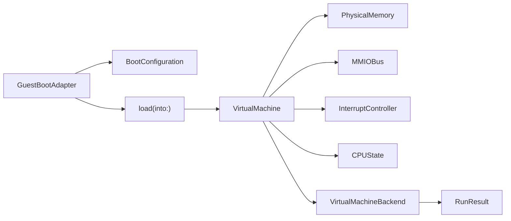

# Architecture

`arm64viz` separates the virtual machine into small, replaceable interfaces.
The initial implementation is deliberately narrow: it can run a toy guest that
uses a tiny AArch64 instruction subset and a memory-mapped UART. The same
interfaces are meant to survive later backends with higher fidelity.

## Core Model

## ARM64 VM Architecture

The VM is a composition root. It owns:

- A single ARM64 CPU state object with general registers, `sp`, `pc`, and a
  halted flag.
- A contiguous RAM aperture with a guest physical base address.
- An MMIO bus that dispatches reads and writes to range-registered devices.
- An interrupt controller abstraction.
- A backend that executes or delegates CPU work.

The current `SoftwareARM64Backend` interprets a small subset:

- `MOVZ` / `MOVK`
- `ADD` / `SUB` immediate
- `STRB` unsigned immediate
- `STR` / `LDR` unsigned immediate for 64-bit values
- `B` / `BL`
- `NOP`
- `HLT`

That is enough for a deterministic toy guest and for testing memory/MMIO
plumbing.

## Virtual CPU And Memory

`CPUState` is plain `Codable` data so snapshots and tests can inspect it. `X31`
is treated as the zero register for the implemented data-processing subset.
The VM routes physical accesses to RAM when the address falls inside
`PhysicalMemory.range`; otherwise it tries the MMIO bus.

RAM is little-endian and byte-addressable. Multi-byte helpers are intentionally
implemented in terms of byte operations to keep access behavior easy to audit.

## MMIO Device Framework

`MMIODevice` has a name, an address range, and typed `read` / `write` methods.
`MMIOBus` rejects overlapping ranges and computes device-relative offsets. The
framework includes simple models for:

- UART output
- Framebuffer memory
- Touch input registers
- Block storage control/data registers
- Network packet queues

The devices are intentionally generic. They are not models of proprietary
hardware.

## Interrupt Controller

`InterruptController` exposes pending, enabled, acknowledged, and active-line
state. `SimpleInterruptController` is a deterministic GIC-style line controller
used by the software backend. `VirtualGIC` provides a small MMIO surface for
distributor enable/pending registers and CPU-interface acknowledge/EOI
registers. The ARM generic timer asserts the physical timer line when
`CNTP_CTL_EL0` and `CNTP_CVAL_EL0` indicate a due, unmasked timer.
`VirtualUART` models PL011-style raw, masked, and clear interrupt registers for
TX-ready and RX FIFO events.

## Virtio MMIO Devices

`VirtualVirtIODevice` provides a shared virtio-mmio register surface for block,
network, input, and display/GPU device IDs. It supports discovery registers,
feature selectors, queue setup registers, status reset, interrupt status/ack,
device config space, and disk-image staging into the virtio block backing
store. Descriptor-ring execution is not implemented yet, so these devices are
discoverable by open guests but do not yet complete Linux block/network/input or
display requests.

## Device Tree And Boot Configuration

`BootConfiguration` describes RAM, CPU count, boot arguments, entry point, and
device descriptors. It can render a DTS-style text tree for open guests or for
debugging boot handoff state.

`FlattenedDeviceTree` emits binary FDT blobs for the native Linux handoff path.
The generated tree includes `/chosen`, RAM, CPUs, aliases, and the current
generic MMIO devices. When an initrd is supplied, the encoder adds
`linux,initrd-start` and `linux,initrd-end`.

## Adapter Registry And Planning

`BootPlanning.swift` adds a metadata-only planner for the major use cases this
framework can grow toward:

- Toy UART guest.
- Raw open ARM64 binaries.
- RTOS and microkernel images.
- Linux direct boot.
- AOSP Android without proprietary services or vendor firmware.
- BSD ARM64 images.
- Proprietary guest boundary review.

The planner classifies artifact names and sizes only. Restricted package
suffixes such as `.ipsw`, `.im4p`, `.im4m`, `.img4`, and `.bbfw` are blocked
before any adapter can claim them.

## Native Linux And postmarketOS Preparation

`LinuxDirectBootAdapter` is the owned Linux boot-preparation path. It does not
launch QEMU. It loads an open ARM64 Linux `Image`, optionally stages an initrd,
optionally stages a disk image into the virtio block device, generates or
accepts a caller-supplied binary FDT, resets the VM to the kernel entry point,
and sets `x0` to the FDT address per the ARM64 Linux handoff convention.

The adapter enters the guest in masked EL1h. The current software backend is
not yet a Linux-capable CPU implementation, but it now covers the first tranche
of early ARM64 branch, PC-relative addressing, stack-pointer arithmetic, pair
load/store, and barrier instructions. It also models deterministic EL1 system
registers and a first 4 KB stage-1 page-table walker for translated
instruction/data access. First-level synchronous exception routing now covers
`SVC`, instruction/data aborts, `ESR_EL1`/`FAR_EL1`/`ELR_EL1`/`SPSR_EL1`, and
`ERET`. The interrupt slice now covers masked/unmasked EL1 IRQ vectoring, timer
IRQ assertion, minimal GIC MMIO enable/ack/EOI behavior, PL011-style UART
interrupt status/mask/clear registers, discoverable virtio-mmio devices, and
basic MMU access-flag/read-only/execute-never faults. The remaining execution
work is Linux-grade interrupt priority/nesting behavior, richer MMU attributes,
TLB maintenance, PL011 FIFO/control fidelity, and virtio descriptor-ring
execution for block, network, input, and display devices.

`run-linux-trace` is the first diagnostic milestone for this path. It prepares
the same Linux/postmarketOS handoff, enables a bounded instruction trace inside
`VirtualMachine`, runs the owned software backend, and reports the CPU state,
recent fetched instructions, recent routed exceptions, and the backend feature
that likely blocks the next step.

## Archived MobileOS Track

The JavaScript MobileOS track is disabled. `RuntimeDirection` marks native
Linux/postmarketOS as the active track, and the old launch paths now return
`unsupportedGuest` instead of building or booting a JavaScript OS.

The archived files remain useful as reference models for scheduler, IPC,
compositor, VFS, PTY, and shell-contract tests, but they are not the runtime
direction:

- `MobileOSImageBootAdapter` refuses `.mosimg` boot.
- `MobileOSKernel.boot` refuses the JavaScript runtime demo.
- `run-mobile`, `build-mobile-image`, and `mobile-kernel-demo` are disabled.
- `ui/mobile-os.html` is a static archived-track page.

## iOS Hardware Test Host

`Apps/iOS/MobileOSHost` is a SwiftUI app that links the local `ARM64VizCore`
package and prepares the native Linux/postmarketOS handoff inside an ordinary
iOS app process. It is intended to test the VM and boot-preparation code on
iPhone hardware while staying inside the app sandbox:

- Linux direct-boot adapter state.
- Generated FDT address and size.
- Kernel entry and `x0` handoff register.
- Remaining backend work for Linux execution.

It does not replace the device OS or participate in the iPhone boot chain.

## Snapshot And Debug Tooling

Snapshots capture:

- CPU state
- RAM base and bytes
- UART output
- Current breakpoint list

Debug support currently includes breakpoints and instruction-step accounting.
The roadmap adds tracing, watchpoints, register diffs, and deterministic replay.
